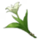
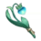

# JSON Paradise

Compilado de teleportes para Genshin Impact feito para reduzir o desperdício de tempo em rotas repetitivas e melhorando a eficiência de sua experiência de jogo.

---
Ultima Atualização:

---

## Sumário
> Sumário com todos os topicos neste post.

- [**Como baixar?**](#como-baixar)
  - [Baixar arquivos individuais](#baixar-arquivos-individuais)
  - [Baixar diretório completo](#baixar-diretório-completo)
  - [Como procurar na pagina?](#como-procurar-na-pagina)
  - [Como usar os tp](#como-usar-os-tps)
- [**Exploração**](#exploração)
  - [Baus](#baus)
  - texto
  - texto
- [**Farming**](#farming)
  - [Oculis](#oculis)
  - [Especialidades](#especialidades)

# Como baixar?
> /

# Baixar arquivos individuais
> /

# Baixar diretório completo
> /

# Como usar os TPs?
> /

# Como procurar na pagina?
> Pressione "CTRL + F" e digite na caixa oque você quer
>
> Para uma pesquisa com mais precisão não inclua hífen ( - )
>
> Por exemplo, pesquise “doce” ou “flor” em vez de “flor-doce”.

# Exploração
----

# Baus
| Icon                  | Nome                 |    
| ---------- | ----------------------------------- | 
|       | [Mondstadt](https://raw.githubusercontent.com/gabszap/json-beta/main/download/Mondstadt.rar?raw=true)| 
|       | [Liyue](https://raw.githubusercontent.com/gabszap/json-beta/main/download/Liyue.rar?raw=true)| 
|       | [Inazuma](https://raw.githubusercontent.com/gabszap/json-beta/main/download/Inazuma.rar?raw=true)| 
|       | [Sumeru](https://raw.githubusercontent.com/gabszap/json-beta/main/download/Sumeru.rar?raw=true)| 
|       | [Fontaine 4.0-4.3](https://raw.githubusercontent.com/gabszap/json-beta/main/download/Fontaine%204.0-4.3.rar?raw=true)| 
|       | [Enkanomiya](https://raw.githubusercontent.com/gabszap/json-beta/main/download/Enkanomiya%20(desbloquear%20primeiro).rar?raw=true)| 
|       | [Espinha do Dragão](https://raw.githubusercontent.com/gabszap/json-beta/main/download/Dragonspine.rar?raw=true)| 
|       | [Despenhadeiro](https://raw.githubusercontent.com/gabszap/json-beta/main/download/Despenhadeiro.rar?raw=true)| 
|       | [Despenhadeiro Subterraneo](https://raw.githubusercontent.com/gabszap/json-beta/main/download/Minas%20subterraneas%20(despenhadeiro).rar?raw=true)|
|       | [Vale Chenyu](https://raw.githubusercontent.com/gabszap/json-beta/main/download/Vale%20Chenyu.rar?raw=true) |

# Farming
-----
## Oculis
> NOTAS:
>
> Atualmente há 216 hydroculos no mapa (Genshin 4.2)
>
> Espinha ate lvl 8 o restante é so missao a cada 3 dias para pegar 5 
> 
> Há informações extras nos numeros pequenos do lado do nome do item.

| Icon                                             | Nome               | Região          |
| ---------- | ----------------------------------------------------- | --------------------- |
|      |[Anemoculus](https://github.com/Gabriel4927/json-paradise/raw/main/download/Anemoculus.rar)        |Mondstadt               | 
|          |[Geoculus](https://github.com/Gabriel4927/json-paradise/raw/main/download/Geoculus.rar)          |Liyue                   | 
|  |[Electroculus](https://github.com/Gabriel4927/json-paradise/raw/main/download/Electroculus.rar)      |Inazuma                 | 
|    |[Dendroculus](https://github.com/Gabriel4927/json-paradise/raw/main/download/Dendroculus.rar)       |Sumeru                  | 
|      |[Hydroculus](https://github.com/Gabriel4927/json-paradise/raw/main/download/Hydroculus.rar)        |Fontaine                |  
|      |[Calcedônia Carmesim](https://github.com/Gabriel4927/json-paradise/blob/main/download/CalcedoniaCarmesim.rar) |Espinha do dragão     | 
|        |[Espato Lúmen](https://github.com/Gabriel4927/json-paradise/raw/main/download/EspatoLumen.rar)      |Despenhadeiro: subterrâneo | 
|     |[Minério Lúmen](https://github.com/Gabriel4927/json-paradise/raw/main/download/MinerioLumen.rar)[^1] |Despenhadeiro: subterrâneo | 
|             |[Padrões de chave](https://github.com/Gabriel4927/json-paradise/raw/main/download/Padr%C3%B5es%20de%20chave.rar)[^2] | Enkanomiya             | 
|            |[Selo Sagrado](https://github.com/Gabriel4927/json-paradise/raw/main/download/Selo%20Sagrado.rar)      |Sumeru: Deserto            | 

# Especialidades
> Especialidades estão separadas por região.
- [Mondstadt](#mondstadt)
- [Liyue](#liyue)
- [Inazuma](#inazuma)
- [Sumeru](#sumeru)
- [Fontaine](#fontaine) (atualizado conforme as expansões)

## Bônus de personagem
> Certos têm Talentos que ajudam a identificar especialidades locais, indicando-os com um ícone de mão no minimapa:

| Icon                        | Nome                        | Região                | Descrição                 |
| ---------------------------------- | --------------------- | --------------------- | --------------------------|
|  | Klee                 | Mondstadt | Mostra a localização de **especialidades de Mondstadt** próximas no mapa.
|  | Mika                 | Mondstadt | Mostra a localização de **especialidades de Mondstadt** próximas no mapa.
|  | Yanfei           | Liyue     | Mostra a localização de **especialidades de Liyue** próximas no mapa.
|      | Qiqi             | Liyue     | Mostra a localização de **especialidades de Liyue** próximas no mapa.
|  | Tighnari        | Sumeru    | Mostra a localização de **especialidades de Sumeru** próximas no mapa.
|  | Nahida          | Sumeru    | Nahida pode usar **Esquemas Universais** para interagir com outros objetos coletáveis dentro de uma certa AdE.
|  | Gorou              | Inazuma   | Mostra a localização de **especialidades de Inazuma** próximas no mapa.
|  | Lyney              | Fontaine  | Mostra a localização de **especialidades de Fontaine** próximas no mapa.

# Mondstadt

| Icon                                         | Nome              | Região     |
| --------------- | -------------------------------------------- | ------------------ | 
|  | [Cecilia](https://github.com/Gabriel4927/json-paradise/raw/main/download/Especialidades/Cecillia.rar) | Mondstadt | 
|  | [Cogumelo Philanemo](https://github.com/Gabriel4927/json-paradise/raw/main/download/Especialidades/Cogumelo_Philanemo.rar) | Mondstadt | 
|  | [Gancho do Lobo](https://github.com/Gabriel4927/json-paradise/raw/main/download/Especialidades/Gancho_do_lobo.rar) | Mondstadt | 
|  | [Lampada de Grama](https://github.com/Gabriel4927/json-paradise/raw/main/download/Especialidades/Lampada_de_grama.rar) | Mondstadt | 
|  | [Margaridas Voadoras](https://github.com/Gabriel4927/json-paradise/raw/main/download/Especialidades/Margaridas_Voadoras.rar) | Mondstadt | 
|  | [Semente de Dandelion](https://github.com/Gabriel4927/json-paradise/raw/main/download/Especialidades/Sementes_de_dandelion.rar) | Mondstadt | 
|  | [Valberry](https://github.com/Gabriel4927/json-paradise/raw/main/download/Especialidades/Valberry.rar) | Mondstadt | 

# Liyue

| Icon                                         | Nome              | Região   |
| --------------- | -------------------------------------------- | ------------------ |
|  | [Concha Estrelada](https://github.com/Gabriel4927/json-paradise/raw/main/download/Especialidades/Concha_Estrelada.rar) | Liyue | 
|  | [Cor Lapis](https://github.com/Gabriel4927/json-paradise/raw/main/download/Especialidades/CorLapis.rar) | Liyue | 
|  | [Flor de Seda](https://github.com/Gabriel4927/json-paradise/raw/main/download/Especialidades/Flor_de_seda.rar) | Liyue | 
|  | [Jade Nocticulosa](https://github.com/Gabriel4927/json-paradise/raw/main/download/Especialidades/Jade_Nocticulosa.rar) | Liyue | 
|  | [Lirio de Vidro](https://github.com/Gabriel4927/json-paradise/raw/main/download/Especialidades/Lirio_de_Vidro.rar) | Liyue | 
|  | [Pimenta de Jueyun](https://github.com/Gabriel4927/json-paradise/raw/main/download/Especialidades/Pimenta_de_Jueyun.rar) | Liyue | 
|  | [Qingxin](https://github.com/Gabriel4927/json-paradise/raw/main/download/Especialidades/Qingxin.rar) | Liyue | 
|  | [Violeta](https://github.com/Gabriel4927/json-paradise/raw/main/download/Especialidades/Violeta.rar) | Liyue | 

# Inazuma

| Icon                                         | Nome              | Região    |
| --------------- | -------------------------------------------- | ------------------ |
|  | [Dendrobio](https://github.com/Gabriel4927/json-paradise/raw/main/download/Especialidades/Dendrobium.rar) | Inazuma | 
|  | [Erva Naku](https://github.com/Gabriel4927/json-paradise/raw/main/download/Especialidades/Erva_Naku.rar) | Inazuma | 
|  | [Fruto Tenkumo](https://github.com/Gabriel4927/json-paradise/raw/main/download/Especialidades/Fruto_Tenkumo.rar) | Inazuma | 
|  | [Fungos Fluorescentes](https://github.com/Gabriel4927/json-paradise/raw/main/download/Especialidades/Fungo_Fluorescente.rar) | Inazuma | 
|  | [Fungos Marítimos](https://github.com/Gabriel4927/json-paradise/raw/main/download/Especialidades/Fungo_Maritimo.rar) | Inazuma | 
|  | [Medula de Cristal](https://github.com/Gabriel4927/json-paradise/raw/main/download/Especialidades/Medula_de_Cristal.rar) | Inazuma | 
|  | [Onikabuto](https://github.com/Gabriel4927/json-paradise/raw/main/download/Especialidades/Onikabuto.rar) | Inazuma | 
|  | [Pérola Sango](https://github.com/Gabriel4927/json-paradise/raw/main/download/Especialidades/Perola_Sango.rar) | Inazuma | 
|  | [Pétalas da Flor de Sakura](https://github.com/Gabriel4927/json-paradise/raw/main/download/Especialidades/Petalas_de_Sakura.rar) | Inazuma | 

# Sumeru

| Icon                                         | Nome              | Região  |
| --------------- | -------------------------------------------- | ------------------ |
|  | [Baga de espinheiro](https://github.com/Gabriel4927/json-paradise/raw/main/download/Especialidades/Baga_de_Espinheiro.rar) | Sumeru | 
|  | [Escaravelho dourado](https://github.com/Gabriel4927/json-paradise/raw/main/download/Especialidades/Escaravelho.rar) | Sumeru | 
|  | [Flor do luto](https://github.com/Gabriel4927/json-paradise/raw/main/download/Especialidades/Flor_do_Luto.rar) | Sumeru | 
|  | [Gordura de pupa de areia](https://github.com/Gabriel4927/json-paradise/raw/main/download/Especialidades/Gordura_de_pupa_de_areia.rar) | Sumeru | 
|  | [Lotus kalpalata](https://github.com/Gabriel4927/json-paradise/raw/main/download/Especialidades/Lotus_Kalpalata.rar) | Sumeru | 
|  | [Lotus nilotpala](https://github.com/Gabriel4927/json-paradise/raw/main/download/Especialidades/Lotus_Nilotpala.rar) | Sumeru | 
|  | [Padirasah](https://github.com/Gabriel4927/json-paradise/raw/main/download/Especialidades/Padisarah.rar) | Sumeru | 

# Fontaine
> Atualmente só tem essas especialidades.

| Icon                                         | Nome              | Região   |
| --------------- | -------------------------------------------- | ------------------ |
|  | [Flor Rociomarinha](https://github.com/Gabriel4927/json-paradise/raw/main/download/Especialidades/Flor_Rociomarinha.rar) | Fontaine | 
|  | [Campânula Lumidouce](https://github.com/Gabriel4927/json-paradise/raw/main/download/Especialidades/Campanula_Lumidouce.rar) | Fontaine | 
|  | [Rosa Arco-Iris](https://github.com/Gabriel4927/json-paradise/raw/main/download/Especialidades/Rosa_ArcoIris.rar) | Fontaine | 
|  | [Lumitoile](https://github.com/Gabriel4927/json-paradise/raw/main/download/Especialidades/Lumitoile.rar) | Fontaine | 
|  | [Unidade de Subdetecção](https://github.com/Gabriel4927/json-paradise/raw/main/download/Especialidades/Unidade_de_Subdetecção.rar) | Fontaine | 
|  | [Flor da Luz do Lago](https://github.com/Gabriel4927/json-paradise/raw/main/download/Especialidades/FlorDaLuzDoLago.rar) | Fontaine |

[^1]: Minério Lúmen é usado para upar o nivel da lanterna.
[^2]: Já ter feito todas as missões de enkanomiya antes de ir atras dos padrões de chave. Onde usar os padrões de chave: https://youtu.be/_ES5BTwIp_M?si=IapwxOCtptDzCO-A

